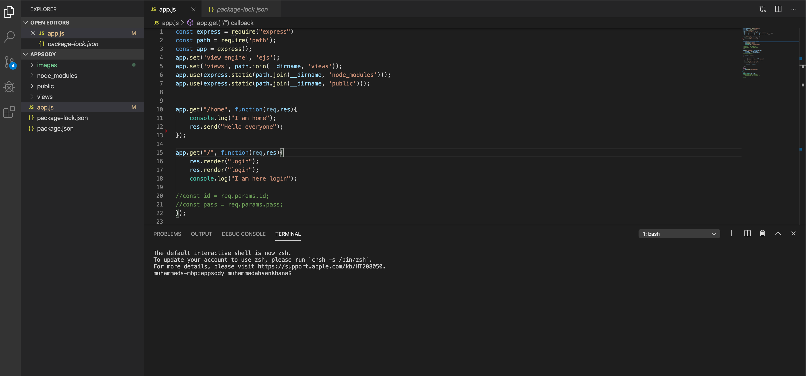
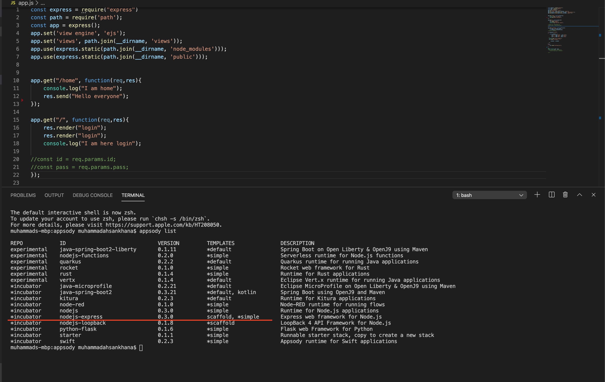
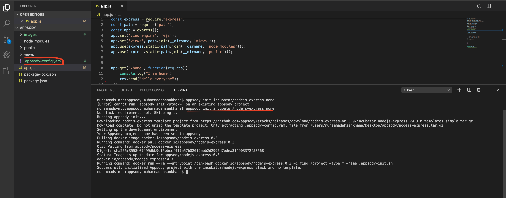
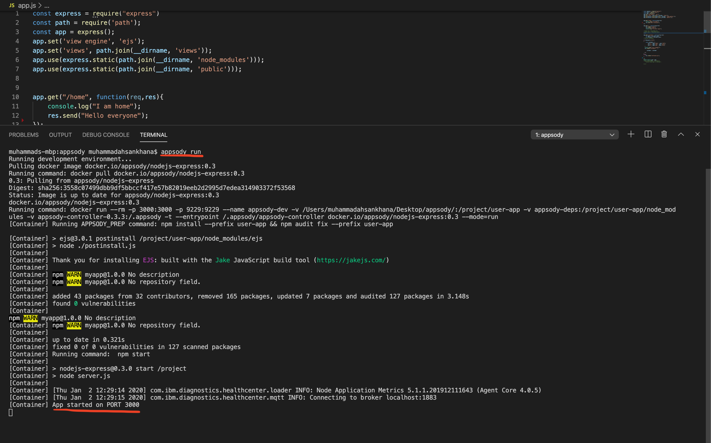
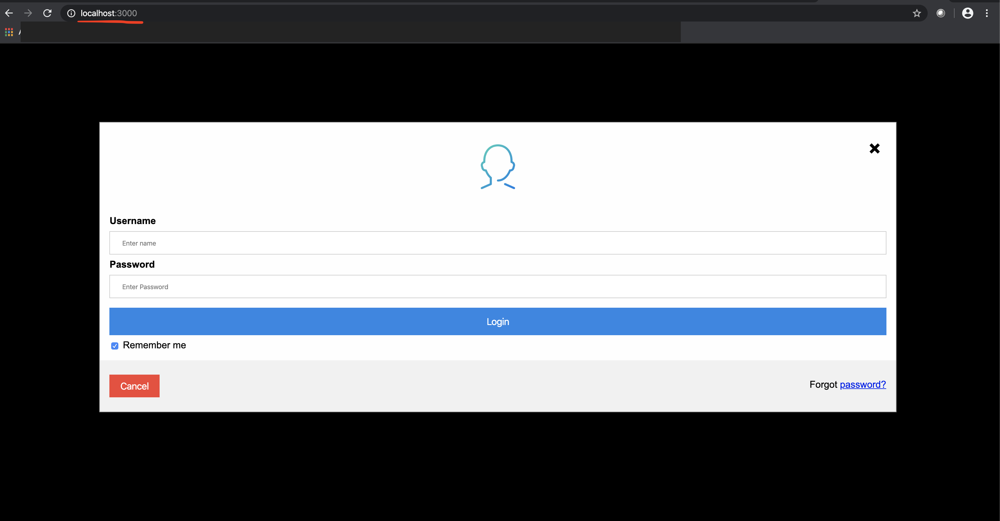
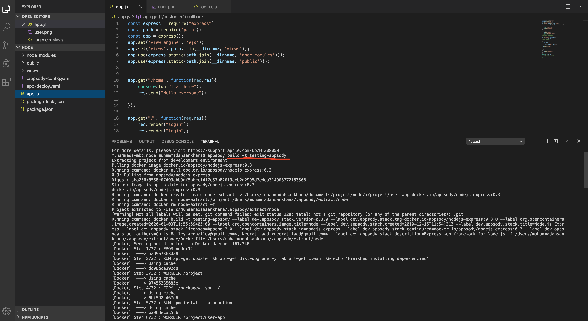
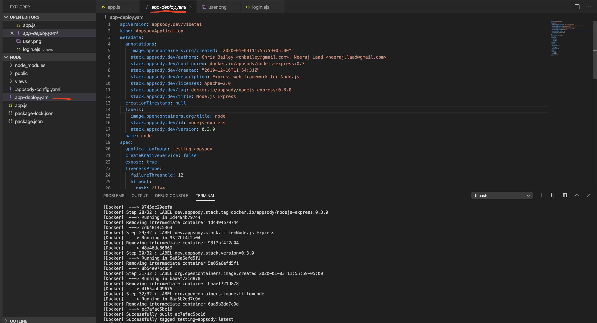
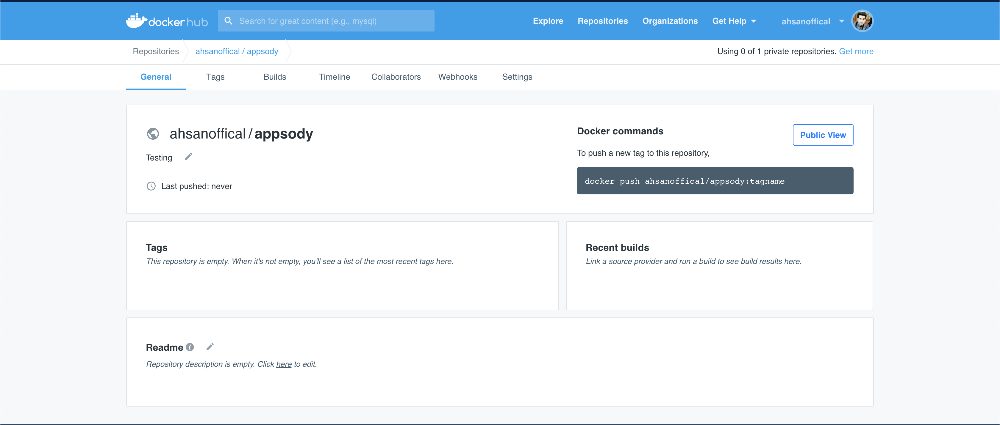
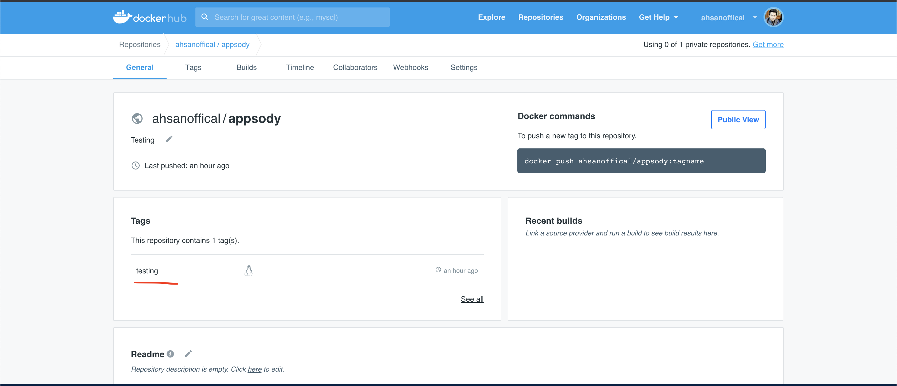

# Do local development, containerize and migrate to Docker Hub using Appsody

Only 30% of enterprises migrated to Cloud other 70% want's to but due to insufficient technical knowledge in app modernization they can’t migrate their on prem data to Cloud. As for that they need to apply various technology stacks before moving to Cloud some of them are Docker, Containerization, Kubernetes , CI/CD and many others.

What if we could have single integrated platform , that contains all these platforms  ? 

This tutorial aim to greatly improve developers experience by removing the burden of managing the full software development stack. With Appsody, now developers can do local development, build and deploy applications to the Docker Hub so they can use it anywhere for the cloud or any platform that support docker images , without being an expert on the underlying container technology. You can simply focus on the important stuff - developing application code!

There are 3 main key components:

## Appsody Stacks:
Already built stack and frameworks that only need to be configured into your project such as Java with Eclipse MicroProfile and Node.js with Express

## Appsody Hub:
The Hub is the central point of control for Appsody Stacks where you can find available stacks. create new stacks, or modify existing ones. 

## Appsody CLI:
Appsody CLI allows developers use already build stacks and  bring them into their local development environment. From here, they can build, run, test, and deploy applications locally. Once they are done with their local development can containerize it and deploy on the cloud.

# Let’s move to lab part:
Follow the below steps to deploy your first application using Appsody:
Application (Nodejs with express) . 

*IMPORTANT NOTE*
You must have docker installed on your local machine . 
1.Get Docker from here :https://docs.docker.com/install/
2. We are using Visual Studio Code for local development :https://code.visualstudio.com/

## Step 1: Clone the application

https://github.com/mahsankhaan/appsody.git

## Step 2:Open the application in Visual Code

## Step 3:Install Appsody
https://appsody.dev/docs/getting-started/installation

## Step 4: Initialize Appsody in our application
 .First, choose a stack that closely resembles your existing project.
 .Use appsody list to view the available stacks'
 .As we are using Node.js with express so we will use that stack.
 

 .Run Appsody init command to create the templete
 .Once the templete is successfully intailized , there will be  ".appsody-config.yml" created.

## Step 5: Let's do some local development

When a source code project is initialized with Appsody, you get a local Appsody development container. "Appsody run" starts the development container in run mode in the foreground. Appsody watches your local project directory for file changes and updates the application to reflect code changes as you develop.

Our container is running on PORT 3000.

## Step 6: Now it's time to build and deploy our application on Docker Hub
When we've finished the local development work for our Appsody project,we will containeried our application and upload it on Docker Hub, so that we can easily deploy it to a suitable runtime infrastructure such as IBM cloud platform or any other.

1. We will use the "appsody build" command to generate a deployment Docker image without writing any dockerfile.

2.Once your image is successfully built , we will be able to see "app-deploy.yml".

3. Run "docker images" command and see your image is created on your local machine.

4. Let's login into Docker Hub and create a new repository.

5. Finally push the image to Docker Hub and access the image any where .

6 . Check your local image is successfully uploaded to your Docker Registry.In the future you can pull the image any anywhere by using "docker pull ahsanoffical/appsody:testing" command.

 

